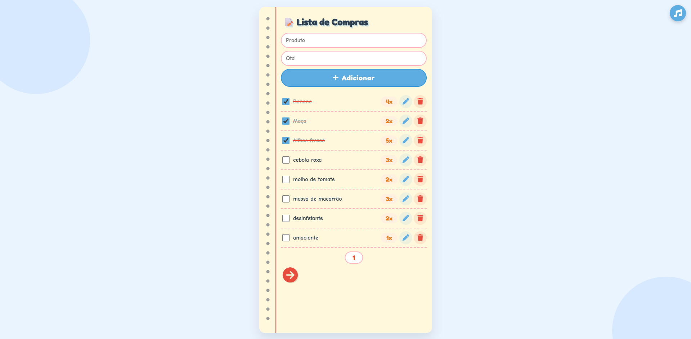

# 📝 Lista de Compras Interativa

## 🎵 Uma Lista de Compras com Estilo de Caderno e Trilha Sonora!

Transforme suas compras em uma experiência divertida! Este projeto é uma lista de compras interativa com design de caderno, animações suaves e música ambiente para armazenar suas compras de forma mais agradáveis.

  

## ✨ Funcionalidades Encantadoras

### 📋 **Interface de Caderno**
- Design realista de folha de caderno com espiral e margem vermelha
- Efeito flutuante no fundo com bolinhas animadas
- Fonte cartoon divertida e amigável

### ☁️ **Armazena os dados**
- Armazena localmente através da função localStorage
- Ao reiniciar a página os itens continuam lá

### 🎮 **Controles Intuitivos**
- **Checkbox interativos** - Marque seus itens e veja o texto ser riscado automaticamente
- **Edição inline** - Clique no lápis para editar qualquer item
- **Remoção rápida** - Lixeira para excluir itens indesejados
- **Paginação** - Navegue entre as páginas com setas coloridas

### 🎵 **Música Ambiente**
- Trilha sonora jazzística feliz para acompanhar suas compras
- Controle de música no canto superior direito
- Ative/desative quando quiser
- Volume suave para não atrapalhar

### 📱 **Totalmente Responsivo**
- Funciona perfeitamente em celulares, tablets e desktops
- Botões adaptados para toque
- Layout que se ajusta a qualquer tela

### ✏️ **Animações Delicadas**
- Itens riscados com animação suave
- Botões com feedback visual ao toque
- Transições fluidas entre páginas

## 🚀 Como Usar

1. **Adicionar item**: Digite o nome do produto e quantidade, clique em "Adicionar"
2. **Marcar item**: Clique no quadrado ao lado do produto
3. **Editar item**: Clique no ícone do lápis ✏️
4. **Remover item**: Clique no ícone da lixeira 🗑️
5. **Navegar**: Use as setas ◀ ▶ para mudar de página
6. **Música**: Clique no ícone de música 🎵 no canto superior direito

## 🛠️ Tecnologias Utilizadas

- **HTML5** - Estrutura semântica
- **CSS3** - Estilização com animações e design responsivo
- **JavaScript (ES6+)** - Toda a lógica interativa
- **Font Awesome** - Ícones bonitos e modernos
- **Google Fonts** - Fontes cartoon personalizadas

## 🎨 Créditos

- Ícones por [Font Awesome](https://fontawesome.com)
- Fontes por [Google Fonts](https://fonts.google.com)
- Inspiração em cadernos clássicos e listas de compras tradicionais
---
Feito por Matheus Victor da Silva Santos
